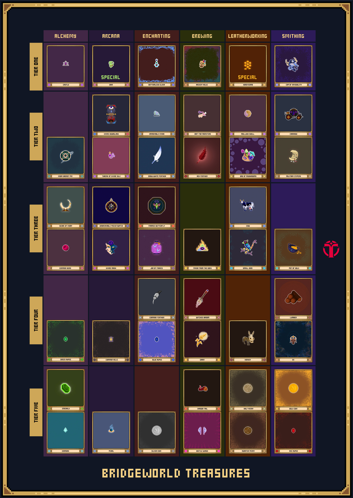

# Crafting Treasures

## How do you craft Treasures?

Treasures can be [crafted in the Forge](https://bridgeworld.treasure.lol/craft/treasures) using Treasure Fragments and some Prism Shards. You will need either a Legion or a Recruit.

You will need to find and assemble 12 fragments of the same tier to craft a Treasure. There are 5 tiers of Treasures: T1, T2, T3, T4, T5.&#x20;

For example:

* 12x T3 Treasure Fragments (and Prism Shards) produce a T3 Treasure.
* Prism Shards which are used with Treasure Fragments to create Treasures.
* Legions and Recruits can craft Treasures with 100% success rate, with no crafting time.

### Recipes for crafting Treasures

To craft Treasures, users need Prism shards and Tier-specific Treasure Fragments. See below for the recipes:

| Treasure Tier | Prism Shards  | Treasure Fragments | Craft EXP Gain |
| ------------- | ------------- | ------------------ | -------------- |
| T5            | 2             | 12                 | 0              |
| T4            | 4             | 12                 | 0              |
| T3            | 8             | 12                 | 0              |
| T2            | 16            | 12                 | 0              |
| T1            | 24            | 12                 | 0              |

Treasure Fragments are found by questing in the Ivory Tower, although have increasingly been spotted in other games across the Treasure ecosystem, such as Realm, KotE, and Beacon.

### Treasure Affinities (deprecated)

This is specific to Bridgeworld's Questing only. In Bridgeworld Questing there are 3 zones which give different types of fragments (different affinities) and you must collect fragments of the same affinity to craft them into a Treasure.&#x20;

NOTE:&#x20;

* In the future these "affinities" will be deprecated and treated the same
* Treasure fragments found in other games will be all the same affinity (so there is no need to think about them)

For now, in Bridgeworld questing, please stick to the same questing zone to collect the same types of fragments.

<figure><figcaption></figcaption></figure>
