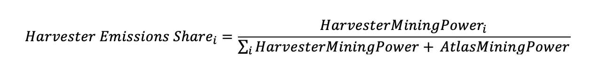

# Harvesters

## Overview

Harvesters are colossal creatures from Bridgeworld that bestow $MAGIC rewards to those who earn their favor. Players play games and competitions in the Treasure ecosystem to gain access and stake MAGIC in Harvesters, and must coordinate with other players and find consumables to feed and maintain their Harvesters to produce a steady flow of MAGIC.\
\
Harvester's compete against each other in producing MAGIC: the better fed and maintained they are, the more MAGIC they pull away from other Harvesters.

## Joining a Harvester

To join a Harvester players must obtain special Ancient Permits permits and stake them in the Harvester. Only after staking Permits can players take MAGIC. The amount of MAGIC a player can stake it based on how many Permits they stake.

Different types of Ancient Permits unique to each Harvester can be discovered in the games and competitions within the Treasure ecosystem.

The following outlines the types of Ancient Permits that players can acquire.

| Permit Type                            | Max Permits / Wallet | MAGIC per Permit |
| -------------------------------------- | -------------------- | ---------------- |
| Atlas Permits for Lupus (Bridgeworld)  | 40                   | 10,000 MAGIC     |
| Emerion Permits (Beacon)               | 20                   | 2,000 MAGIC      |
| Thundermane Permits (KotE)             | 20                   | 2,000 MAGIC      |
| Emberwing Permits (Zeeverse)           | 20                   | 2,000 MAGIC      |

Each Harvester has a limited capacity of Permits and MAGIC that can be staked in them. Below is a detailed overview of the maximum number of Ancient Permits that can be staked in each Harvester.

<table><thead><tr><th width="196">Harvester</th><th>Max # of Ancient Permits</th></tr></thead><tbody><tr><td>Afarit</td><td>RIP</td></tr><tr><td>Asiterra</td><td>RIP</td></tr><tr><td>Emerion (Beacon)</td><td>3,000 Emerion Ancient Permits</td></tr><tr><td>Kameji</td><td>RIP</td></tr><tr><td>Lupus Magus (Bridgeworld)</td><td>1,500 Atlas Ancient Permits (soulbound)</td></tr><tr><td>Shinoba</td><td>RIP</td></tr><tr><td>Thundermane (KotE)</td><td>3,000 Thundermane Ancient Permits</td></tr><tr><td>Emberwing (Zeeverse)</td><td>3,000 Emberwing Ancient Permits</td></tr></tbody></table>

## Boosting a Harvester

Upon joining a Harvester, a player can use a variety of items to increase the MAGIC their Harvester can produce. Their mission is to find and produce special NFTs and consumables within the Treasure ecosystem to maximize its MAGIC rewards. Some stakeable NFTs and consumables include:

1. **MAGIC:** Harvesters power up and produce more MAGIC as more players stake MAGIC (up to the 6mil cap)
2. **Character NFTs across the Treasure ecosystem**: Certain character NFTs such as Squires (KotE), Moonfae Pets (Beacon), Legions (Bridgeworld), and Zee can be staked in their respective Harvesters to boost MAGIC for individual wallets.
3. **Metabolic Boosters**: Special consumables that provide a significant boost to the Harvester's MAGIC production. These are crafted from Treasures and different types of Balancer Crystals (crafted from various LP tokens) found in the ecosystem.
4. **Corruption**: A toxis substance which must be removed from Harvesters to keep them healthy and producing MAGIC. It can be forged by players and used to sabotage enemy Harvesters.

Each player is a crucial to the performance of each Harvester, contributing to the collective effort of discovering more MAGIC of other players in the Harvester, and shaping their journey in this magical realm.

### MAGIC Utilization Boost

Harvesters only produce MAGIC after the amount of staked MAGIC to it is at least 5% of it's 6 mil capacity. Once this threshold is crossed, Magic emission levels will gradually increase at every 10% interval, until the Harvester reaches its peak emission potential at +80% utilization. See the following table:

| Harvester Capacity Utilisation | MAGIC required     | Emissions Activated |
| ------------------------------ | ------------------ | ------------------- |
| Less than 5%                   | < 300k MAGIC       | 0%                  |
| Between 5% and 10%             | 300k \~ 600k MAGIC | 20%                 |
| Between 10% and 20%            | 600k \~ 1.2M MAGIC | 30%                 |
| Between 20% and 30%            | 1.2M \~ 1.8M MAGIC | 40%                 |
| Between 30% and 40%            | 1.8M \~ 2.4M MAGIC | 50%                 |
| Between 40% and 50%            | 2.4M \~ 3M MAGIC   | 60%                 |
| Between 50% and 60%            | 3M \~ 3.6M MAGIC   | 70%                 |
| Between 60% and 70%            | 3.6M \~ 4.2M MAGIC | 80%                 |
| Between 70% and 80%            | 4.2M \~ 4.8M MAGIC | 90%                 |
| Above 80%                      | >4.8M MAGIC        | 100%                |

### Character NFTs across the Treasure Ecosystem

Each Harvester allows for certain characters to power up a user's deposit. Staking characters from across the Treasure ecosystem helps increase your Harvester’s  Power and boosts your assets within the Harvester. Characters multiply the size of the Player’s MAGIC deposit, increasing the Player’s personal share of MAGIC from a Harvester.

Players may stake multiple characters in a Harvester. Each Harvester has specific constraints on the number of characters that can be staked in it. Below is a breakdown of the types of characters that can be staked in each harvester.&#x20;

<table><thead><tr><th width="216">Harvester</th><th>Character</th></tr></thead><tbody><tr><td>Afarit (RIP)</td><td>Auxiliary and Genesis Legions</td></tr><tr><td>Emerion (Beacon)</td><td>Beacon Moonfae Pets and Legions</td></tr><tr><td>Lupus Magus (BW)</td><td>Auxiliary and Genesis Legions</td></tr><tr><td>Thundermane (KotE)</td><td>Squires and Treasures</td></tr><tr><td>Emberwing (Zeeverse)</td><td>Zee and Legions</td></tr></tbody></table>

### **Legions**

In Harvesters where Legions are essential, each has a "weight class". A tonnage limit of 220kg per wallet applies to the Legions staked. In the Emerion and Emberwing Harvesters, Legions have a max weight of 40kg.

The weights and boosts for each Legion class are outlined in the table below.

| Legion Class       | Boost | Weight (kg) |
| ------------------ | ----- | ----------- |
| Genesis 1/1        | 600%  | 120 kg      |
| Genesis All Class  | 200%  | 40 kg       |
| Genesis Uncommon   | 100%  | 21 kg       |
| Genesis Special    | 75%   | 16 kg       |
| Genesis Common     | 50%   | 11 kg       |
| Auxiliary Rare     | 25%   | 5.5 kg      |
| Auxiliary Uncommon | 10%   | 4 kg        |
| Auxiliary Common   | 5%    | 2.5 kg      |

### Beacon Moonfae Pets

In the Emerion Harvester, players can stake up to a trio of these mystical creatures. These pets serve as cherished companions and valuable assets in the pursuit of MAGIC. The yield boost attributed to a Pet has a direct influence on the deposit boost a user receives when the Pet is deployed within a Harvester, see below for more details.&#x20;

| Moonfae Pet Yield Boost | Boost in Harvester |
| ----------------------- | ------------------ |
| 10%                     | 20%                |
| 13.33%                  | 25%                |
| 16.66%                  | 30%                |
| 20%                     | 35%                |

### Knights of the Ether Squires

In Harvesters such as Thundermane, players have the ability to stake up to 5 Squires. Squire yield boosts will give a 15% boost to the deposit size of the player each.&#x20;

Players can also stake up to 20 Treasures to a Harvester, which boosts the player's deposit.&#x20;

### Emberwing Zee

In Emberwing, players can stake up to 6 Zee per wallet. Zee's use their level metadata attribute as boosts. A level 1 Zee has a boost of \~5%, which gradually increases until level 50 where they have a boost of roughly %19.6

Note that Zee on-chain boosts are periodically updated to reflect their off-chain level (in the game) and so there may be a delay in seeing Zee boost updates

## Metabolic Boosters

Metabolic Boosters play a pivotal role in boosting Harvester emissions. Once activated they provide a temporary surge a Harvester's mining power, amplifying the Harvester's ability to produce MAGIC.

Each Metabolic Booster lasts only a limited duration and are consumed after use (burned). You can stack Metabolic Boosters however, up to 10 may be deployed at a time. When a Metabolic Booster is in active use, players can substitute it with a larger variant, like replacing a small Metabolic Booster with a medium one. Players need to coordinate their use of boosters strategically, to maximise MAGIC production.&#x20;

Metabolic Boosters can be crafted from Legions with a crafting experience of level 5 or higher by using Treasures in the Forge.&#x20;

The stacking of Metabolic boosts is additive, with each booster contributing incrementally to the total boost. They have the following attributes:

| Booster Type                                                                    | Boost | Duration |
| ------------------------------------------------------------------------------- | ----- | -------- |
| Small Metabolic Booster                                                         | 20%   | 3hrs     |
| Medium Metabolic Booster                                                        | 25%   | 3hrs     |
| Large Metabolic Booster                                                         | 30%   | 3hrs     |
| [<mark style="color:blue;">**Special Boosters**</mark>](#user-content-fn-1)[^1] |       |          |
| Durable Booster                                                                 | 20%   | 4hrs     |
| Anabolic Booster                                                                | 40%   | 2hrs     |
| Overclocked Booster                                                             | 90%   | 1hr      |

### Calculating a Harvester's emissions

The distribution of MAGIC emissions each Harvester receives is determined by its "Mining Power" as compared to the collective "Mining Power" of all other Harvesters, inclusive of the Atlas Mine. It's a proportional distribution, where the strength of each Harvester directly influences its share of the MAGIC emissions.

For a deeper understanding and more precise calculations of a Harvester's emissions, please refer to the comprehensive [Harvester game guide](https://drive.google.com/file/d/1uTw85vDFHQJNacUQYbwiSfjJQfbgBgoR/view). It provides detailed insights and explanations, making it an invaluable resource for players seeking to optimize their MAGIC earnings.&#x20;

<figure><figcaption>
Formula for calculating how much MAGIC a Harvester should receive
</figcaption></figure>

<figure><figcaption></figcaption></figure>

## Harvester Deaths

Periodically, competitive Bridgeworld events will pit players in guild versus guild game formats from the ecosystem to determine which Harvesters are destroyed. \
\
In the inaugural [Harvester Doomsday](corruption/doomsday.md) event, the original Harvesters Shinoba, Asiterra, and Kameji were destroyed. Their remnants litter the plains and players may revisit their remains to collect their belongings: [https://bridgeworld.treasure.lol/harvesters/all](https://bridgeworld.treasure.lol/harvesters/all)

\

[^1]: 
