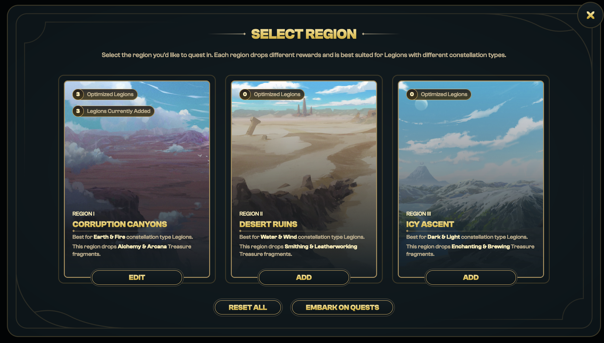

# Constellation Quests

## Embarking on Quests

There are three regions a Legion can quest in. Each region drops a specific affinity of Treasure Fragments which can then be used to craft full Treasures based on their affinity type. View [here](https://docs.bridgeworld.treasure.lol/gameplay/the-forge/crafting-treasures) for an overview of Treasure affinities.

<figure><figcaption>
Sending a Legion to quest within a specific region. 'Optimized' Legions have the same constellation as the region.
</figcaption></figure>

Legions have the opportunity to quest through three parts of a quest. In order to progress further into a journey, Legions must satisfy questing level requirements:

* Part 1: Requires Legions to be at least Questing level 1
* Part 2: Requires Legions to be at least Questing level 2
* Part 3: Requires Legions to be at least Questing level 3

Continuing a journey for rarer Treasures comes with risk. Users forfeit whatever loot they earned in the previous sections (see [Questing Rewards](constellation-quests.md#quest-rewards) below for more details), and Auxiliary Legions run the risk of falling into “stasis”, which will temporarily immobilize the Legion.

Players that travel to the 3rd section must also play the Treasure Triad Card game using equipped Treasures. See [Treasure Triad](https://docs.treasure.lol/cartridges/bridgeworld/ivory-tower/treasure-triad) for gameplay details.

#### **Each level of constellation protects your Auxiliary Legion and reduces the chance of stasis (default 30%):**

| Constellation Level   | Stasis Reduction |
| --------------------- | ---------------- |
| Level 1 Constellation | reduce by 4%     |
| Level 2 Constellation | reduce by 6%     |
| Level 3 Constellation | reduce by 8%     |
| Level 4 Constellation | reduce by 10%    |
| Level 5 Constellation | reduce by 15%    |
| Level 6 Constellation | reduce by 20%    |
| Level 7 Constellation | reduce by 25%    |

### Questing Rewards 

During questing, Legions receive:

1. Questing XP (amount gained according to table below)
2. Essence of Starlight (EoS) and Prism Shards (amount gained according to table below)
3. Chance of finding a [Universal Lock](https://app.treasure.lol/collection/consumables/10) in all regions and sections
4. Chance of finding Treasure Fragments (see [Treasure Drop Rates](treasure-drop-rates.md) for more information)
5. **Genesis Legion Bonus:** chance of finding full [Treasures](https://app.treasure.lol/collection/treasures) (see [Treasure Drop Rates](treasure-drop-rates.md) for more information)

For Questing XP, EoS and Prism Shards, the rewards depends on the distance traveled:

<table><thead><tr><th width="202">Distance Traveled</th><th width="148">Questing XP</th><th width="222">Essence of Starlight</th><th>Prism Shards</th></tr></thead><tbody><tr><td>1 Section</td><td>10</td><td>1</td><td>1</td></tr><tr><td>2 Sections</td><td>20</td><td>2</td><td>2</td></tr><tr><td>3 Sections</td><td>40</td><td>3</td><td>3</td></tr></tbody></table>
