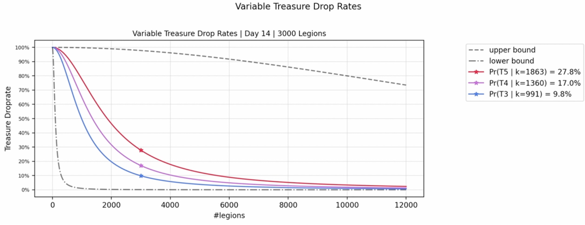

# Treasure Drop Rates

Treasure Fragments are [soulbound](https://vitalik.eth.limo/general/2022/01/26/soulbound.html), non-transferable and are dropped in quests based on the below formula.&#x20;

Each region drops a category of Treasure Fragments as follows:

* Corruption Canyons ⇒ Alchemy/Arcana Fragments
* Icy Ascent ⇒ Enchanting/Brewing Fragments
* Desert Ruins ⇒ Smithing/Leatherworking Fragments

The chance of finding a Treasure Fragment = **1/(1 + (N/k \* s)^2)**

* N = the number of legions questing
* s = a settable constant set to 1
* k = the number of available treasure fragments when legion ends the quest.
  * The number of Treasure fragments gradually increases every second at a fixed rate.
    * e.g. if there is a 30,000 monthly cap for T5, then this works out to be 30,000/(30\*24\*60\*60) = 0.0115740 T5 Treasures per second

This formula produces a drop rate graph as follows:

<figure><figcaption>
Variable droprates based on N (#legions) and k (#treasure fragments remaning in the pool). See this simluation for example of how droprates vary over time: <a href="https://youtu.be/utfZvA0y_sA">https://youtu.be/utfZvA0y_sA </a>​
</figcaption></figure>

| Treasure Tier | Treasure Fragments emitted per Month |
| ------------- | ------------------------------------ |
| T5            | 30,000                               |
| T4            | 21,000                               |
| T3            | 12,000                               |
| T2            | 3,000                                |
| T1            | 1,500                                |

The probability of finding different rarity tiers of Treasure Fragments are outlined below.

Legions can earn multiple fragment Tiers in each section based on the above drop-rate formula, but only one of each tier.

**For section 1**: Legions have a chance of finding up to 2 fragments (1x T5, 1x T4) or none at all.

_You have a chance to find either: (1x T5 and 1x T4) or (1x T5) or (1x T4) or nothing at all. You cannot get 2x T4 or 2x T5._

**For section 2**: Legions have a chance of finding up to 3 fragments: (1x T5, 1x T4, 1x T3) or none at all.

**For section 3**: Legions have a chance of finding up to 3 fragments: (1x T1, 1x T2, 1x T3, 1x T4) or none at all. Traveling to latter sections does not give you rewards from previous sections.

Additional Treasure Fragments are emitted from separate pools for [Bridgeworld Recruits](../training-a-recruit-in-the-barracks.md) and ecosystem partners like [Realm](https://www.rlm.land/), [Tales of Elleria](https://talesofelleria.com/) and [Knights of the Ether](https://knightsoftheether.com/). As more game loops and sinks are built, we may gradually introduce more places to earn Treasure Fragments. Current extra Treasure fragment pools include:

| Game & Treasure Tier      | Treasure Fragments emitted per Month |
| ------------------------- | ------------------------------------ |
| Bridgeworld Recruits (T5) | 5,000                                |
| Realm (T5)                | 5,000                                |
| Tales of Elleria (T5)     | 5,000                                |
| Knights of the Ether (T5) | 10,000                               |
| Knights of the Ether (T4) | 3,500                                |
| Knights of the Ether (T3) | 2,000                                |
| Knights of the Ether (T2) | 500                                  |
| Knights of the Ether (T1) | 250                                  |

Legions with Questing level 4, 5, or 6 have higher chances of finding Treasure Fragments:

| Questing Level | Boosted chance of Treasure Fragment drops |
| -------------- | ----------------------------------------- |
| Level 4        | (1 + 5%) \* BaseDropRate                  |
| Level 5        | (1 + 10%) \* BaseDropRate                 |
| Level 6        | (1 + 15%) \* BaseDropRate                 |

Genesis Legions are immune to stasis in questing, have higher chances of finding Treasure Fragments, and have an additional chance to earn a full Treasure during quests:

| Legion Rarity | Chance of finding full treasure | Boosted chance of finding fragments |
| ------------- | ------------------------------- | ----------------------------------- |
| Common        | 1%                              | (1 + 2.5%) \* BaseDropRate          |
| Special       | 1.5%                            | (1 + 3.75%) \* BaseDropRate         |
| Uncommon      | 2%                              | (1 + 5%) \* BaseDropRate            |
| Rare          | 4%                              | (1 + 10%) \* BaseDropRate           |
| Legendary     | 12%                             | (1 + 30%) \* BaseDropRate           |

## Stacking Droprate Bonuses 

Bonuses to the Treasure Fragment droprates stack as follows: (1 + QuestingLvlBonus + CardFlipBonus + GenesisLegionBonus)

So for instance if the current BaseDropRate is 35%, and a lvl 4 Special Genesis Legion is questing and flipped 3x Cards in the Triad Card Game,

The drop rate is: (1 + 5% + 3.75% + 15%) \* 35%&#x20;

\= (1 + 23.75%) \* 35%

\= 43.31%

**For more details on how the Capped Treasure mechanism is implemented and how it works see:** [**https://docs.google.com/document/d/1l82TwyJMNJ42Bup7Y2C\_E32t1iDuDVIwc79bbiI0V3s**](https://docs.google.com/document/d/1l82TwyJMNJ42Bup7Y2C\_E32t1iDuDVIwc79bbiI0V3s/edit)
