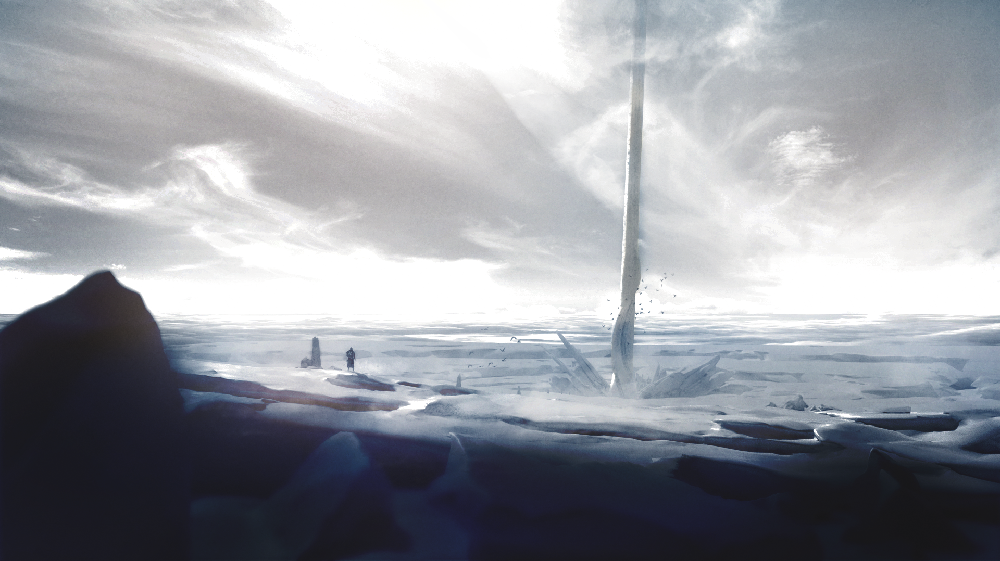

# Ivory Tower


The Ivory Tower looks upon all of Bridgeworld, even beyond the borders of the known realm. From this vantage point, Legions are called when interventions are required, and quests handed out according to each Legion's abilities.


They call it the Dispatcher - "it" because no one knows what it really is, other than the fact that the Legions are called towards it, and leave with a compelling sense of mission. An inexorable desire to complete their quest, unable to return or resist unless the given mission is done.

Attempts to reject or defy the Dispatcher have all met with failure. When the Dispatcher calls, you can but obey. Its orders speak directly to the very being of each Legionnaire and compels them to act.

The Bridgeworld extends far beyond the borders of the known realm - beyond the mountains on the west, and across the river in the east, and the waters of the north and south of the continent lie lands, beings, perils and - not to forget - treasures beyond our imagination.

The Ivory Tower that watches over the world sees all, and where an intervention is needed, the Legions are called.

So it is then, that a Legionnaire, compelled by the call of the Dispatcher, presents his or herself at the Ivory Tower. To each Legionnaire, a quest is assigned, in proportion to their abilities.

Thus the Legions go: far beyond the borders of the known world, invoking the Magic running in their veins and tapping on the primordial sources of power from which their very existence originates to overcome the trials they face.&#x20;

And for those that succeed come the spoils of victory: treasures of great worth, likewise proportionate to the difficulty of their assignment.
