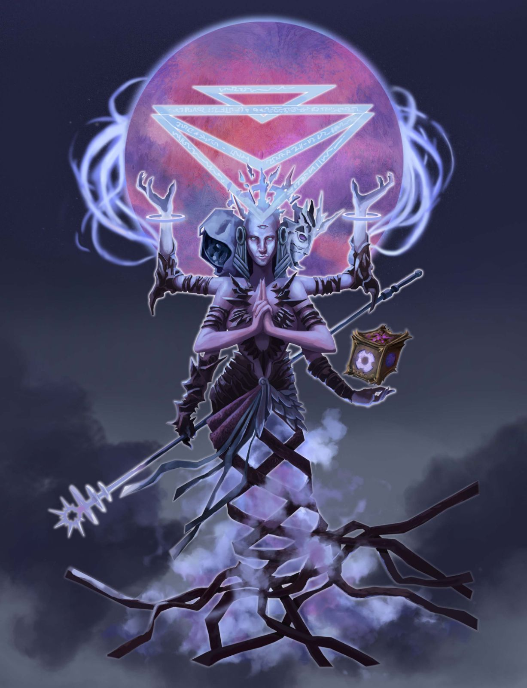

# Orbean, Avatar of Magic

**Orbean, Avatar of Magic**&#x20;

\*”The final stage of understanding is that of the Magic. And with that, comes true mastery.” \*&#x20;

Legions, Arcanists, scientists and spies all pay respect to Orbean as they dedicate themselves to questions that may change the face of the multiverse with their answers.&#x20;

**Holy Symbol:**&#x20;

Orbean’s primary holy symbol is a representation of a complex box covered in arcane symbols, or in some cases an actual puzzle-box. Another symbol common among Orbean’s faithful is stacked or interlocking triangles.&#x20;

**Sample Priesthood:**&#x20;

The Teal Oracles are a fellowship of monks who also venerate Tsuge, Avatar of Passage and work with other clergy of Orbean in temples throughout the Bridgeworld as diviners and soothsayers.&#x20;

Unlike others who purport to pull back time’s veil, The Teal Oracles are known for rarely speaking about the future.&#x20;

Instead, they are said to know what a supplicant most needs to hear to divine their own essence and most appropriately live their life. As with many oracles, their words are often either cryptic or disappointingly mundane.

